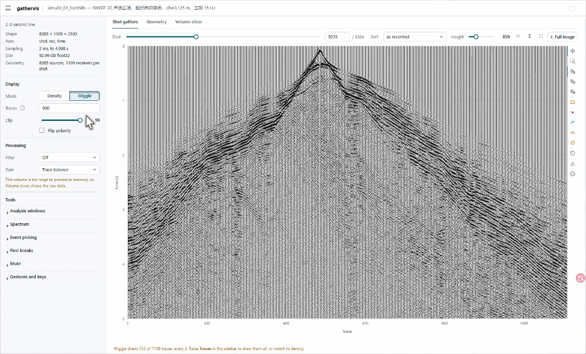
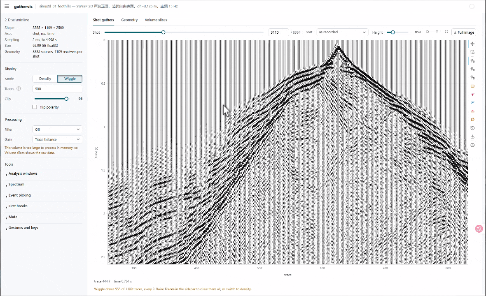
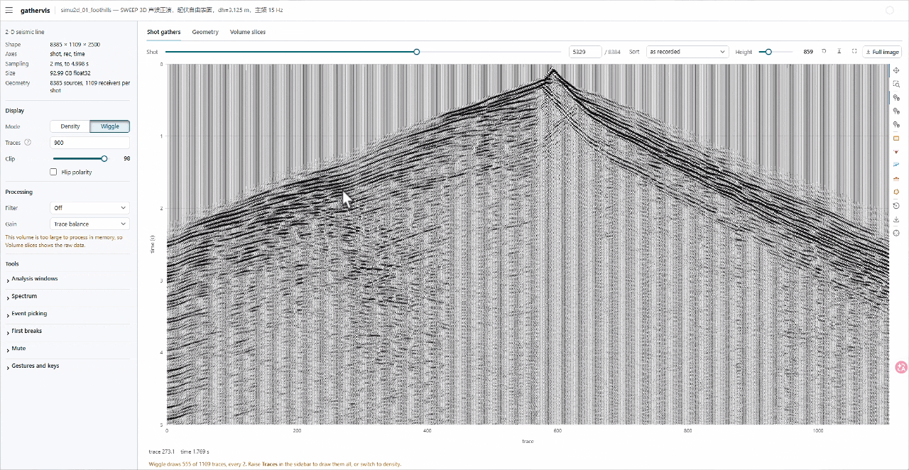

<div align="center">

# gathervis

**English** | [简体中文](https://github.com/zzzzswh/gathervis/blob/main/README.zh-CN.md)

**A professional web viewer for pre-stack seismic data.**

*Open pre-stack data sitting on a remote server in your browser, and work it
the way you would in processing software: browse shots, filter, take spectra,
pick.*









*2-D gather QC and 3-D volume slicing, in one browser tab.*

</div>


> **💬 Feature requests welcome!** If there is anything you wish it did — a
> display mode, a processing step, a file format — **please open an issue and
> tell me. I will implement it.** Thank you very much!
>
> **💬 欢迎提需求！** 如果你希望它能做什么 —— 显示方式、处理步骤、文件格式 ——
> **请务必开 issue 告诉我，我会实现的，非常感谢！**

---

## Why gathervis?

The reason is a practical one: not wanting to draw pre-stack data with
matplotlib one figure at a time. Change shot, redraw. Change a filter
parameter, redraw. Want the spectrum of one time gate and that is another
block of code. The figures come out fine, but the process is broken up, and
every look starts over. gathervis turns it into the kind of viewing you get in
processing software: the data is simply open in a browser, a slider steps
through shots, drawing a box gives you its spectrum, and changing the filter
updates the panel as you type.

* **Instant on huge data.** Files open as lazy memmaps — browsing a shot reads
  only that shot's bytes; slicing a volume reads only that slice. A 100 GB raw
  binary opens as fast as a 1 MB one.
* **Geometry-linked views.** Give it source/receiver coordinates and you get a
  Geometry tab with the CMP fold under the layout — tap any source point to jump to its shot
  gather, with the active spread highlighted; CMP fold is computed from
  coordinates alone.
* **QC tools built in.** Wiggle & variable-density display with industry
  colormaps, zero-phase Ormsby filters, AGC / trace balance, draw-a-window
  spectral analysis (amplitude spectra and f-k), manual / STA-LTA
  first-break picking, top / bottom mutes that carry across gathers, and
  hand-picked CMP velocity analysis.
* **cigvis-style 3-D.** Volumes render as a rotatable cuboid with three live
  slice planes (WebGL), moved by slider or keyboard.
* **A quiet interface.** The sidebar is grouped into display, processing and
  tools, and shows only the controls that act on what is on screen. Shots,
  slices and gathers step from the keyboard. The page fetches nothing from
  the internet, so it loads the same on an offline cluster or behind a
  firewall.
* **Simple.** All it needs is a browser: one port, auto-forwarded by VS Code
  Remote-SSH, rendered inline in Jupyter, and reachable over a bare `ssh -L`.
  Four dependencies, installed with pip.

## Install

```bash
pip install -e .                  # numpy + panel + bokeh + plotly
pip install -e ".[segy]"          # optional, for SEG-Y import
pip install -e ".[examples]"      # optional, torch + deepwave for the
                                  # modelling examples -- ~2.5 GB
```

With uv, the extras are the same names:

```bash
uv sync                           # the viewer
uv sync --extra examples          # + torch/deepwave for examples/deepwave_*.py
uv run --extra examples examples/deepwave_line2d.py    # or just for one run
```

`pyproject.toml` pins torch to the cu121 wheel index for local development.
Without a GPU, or to keep the download small, point uv at the CPU index:
`--index https://download.pytorch.org/whl/cpu`. Only the two `deepwave_*`
examples need any of this; everything else runs on the four base
dependencies.

## Quick start

```python
import gathervis as gv

# -- quick look, no geometry --
gv.show(gather_2d, dt=0.002, port=8080)          # a (trace, time) panel
gv.show(line_3d, dt=0.002, port=8080)            # default (shot, rec, time): browse shots
gv.show(line_3d, view='slices', port=8080)       # same array as a 3-D cuboid w/ slices
gv.show('shots.bin', shape=(60,192,1200),        # raw binary: lazy memmap, opens instantly
        dtype='float32', dt=0.002, port=8080)
gv.show(vel, axes=('x','y','depth'), dt=10.0)    # property volume (velocity QC)

# -- with acquisition geometry --
ds = gv.from_array(data, src=src_xyz, rec=rec_xyz, dt=0.002)
gv.show(ds, port=8080)   # + Geometry tab; tap a source -> its shot gather
```

Or from the shell, no code at all:

```bash
gathervis line2d_data.npy --geom line2d_geom.npz
gathervis shots.bin --shape 60 192 1200 --dt 0.002
gathervis field.sgy                                # SEG-Y: dt + geometry from headers
gathervis vel.npy --axes x y depth --dt 10 --cmap rainbow
```

Examples with synthetic data: `python examples/quickstart.py` serves an
analytic synthetic; `python examples/velocity_picking.py` opens velocity
analysis on a CMP gather whose answer is known;
`python examples/deepwave_line2d.py` models a 2-D line with
[deepwave](https://github.com/ar4/deepwave); and
`python examples/deepwave_lines3d.py` shoots **five 2-D lines over a rich 3-D
velocity model** (dipping layers + anticline dome + low-velocity channel lens)
with deepwave's 3-D engine, then opens the result.

## Features

### Shot browsing and geometry

On the **Shot gathers** tab, the toolbar above the panel holds the shot
slider (it updates the panel while you drag), a box to type a shot number
into and, for 3-D shots, the sort; **←** / **→** step one shot at a time,
**Shift** makes it ten, **Home** / **End** go to the first and last shot. The
view controls sit at the right of the same row, so they stay within reach in
fullscreen.

The sidebar is grouped the way a look at the data goes: **Display** (density
or wiggle, then only what that mode uses: colormap and resolution for
density, trace count for wiggle; clip; polarity), **Processing** (filter and
gain, each showing its parameters only when it is on), and **Tools**:
*Analysis windows*, *Spectrum*, *Event picking*, *First breaks* and *Mute* as
collapsible sections, with the gesture sheet as the last one. Tabs that have
settings of their own add a section while they are showing: the Geometry tab
its map layers and CMP bins, the volume tabs their axis stretch.

The **Geometry** tab is one map: the CMP fold underneath, sources and
receivers on top, the current shot starred and its spread highlighted.
Tapping a source selects that shot and returns to the Shot gathers tab;
*Map layers* in the sidebar switches fold, receivers and sources on and off.


### Trace ordering for 3-D shots

A 3-D shot is a patch of several receiver lines. Processing practice puts the
whole patch on one `(trace, time)` panel and changes the order the traces are
laid out in; the **Sort** selector on the Shot gathers tab provides four
orderings.


*The same shot in three orderings: as recorded (receiver-line breaks dashed),
by offset, by azimuth.*

| sort | description |
| --- | --- |
| **as recorded** `(line, station)` | Acquisition order, receiver lines end to end, displayed as N nested hyperbolas whose apices step with cross-line distance. Used to check geometry errors, reversed lines, polarity flips and dead channels. Dashed separators mark the line boundaries. |
| **receiver line** | One receiver line at a time, i.e. a 2-D shot record. |
| **offset** | Ordered by source-receiver distance; the patch collapses onto one hyperbola. Used for moveout, mute design and velocity analysis. |
| **azimuth** | Ordered by source-to-receiver azimuth (survey convention, north = 0). Used for azimuthal behaviour and azimuth coverage. |

All four orderings are the same 2-D panel, so analysis windows, spectra,
picking and full-resolution export work identically on them. Picks are stored
against the **trace** rather than the screen column, so they follow a re-sort;
picks on traces outside a single-line view are hidden rather than deleted and
return when the view does.

`offset` and `azimuth` require geometry; `receiver line` requires 4-D
`(shot, recy, recx, time)` data, the shape in which the line structure is
explicit. The selector lists only the orderings the dataset supports, and is
hidden for a 2-D line with no geometry. The **Shot volume** tab renders the
current shot as a cuboid on the same filter/gain chain.

Example: `python examples/quickstart.py patch`.

### CMP fold map

Underneath the acquisition layout on the **Geometry** tab — the same survey
asked two ways, so a hole in the fold is a gap in the layout right on top of
it. The fold bins the midpoint of every source-receiver pair on a rectangular
grid, centred on the first midpoint so that regular midpoints fall mid-bin,
and counts them. *CMP bins* in the sidebar sets the bin size and lists the
grid, the live bins, the fold range and the trace count.


*Fold of an orthogonal land 3-D: 25 m stations on 200 m receiver lines, 50 m
shot points on 200 m shot lines half a station off the receiver stations,
fixed full spread.*

Bin size defaults to half the receiver station interval in-line and half the
line interval cross-line, the natural CMP sampling; both are editable under
*CMP bins* in the sidebar, and *Default bin size* restores them. Fold is drawn
in viridis, and empty bins in the background colour rather than at the bottom
of the colour scale. The list under the bin size gives the grid, the live
bins, the fold range and mean, and the trace total — which should equal
`sources × receivers` and serves as a geometry check.

The computation uses coordinates only and reads no trace data, so its cost is
independent of data volume and it works on a bare `Geometry`:

```python
from gathervis.survey import fold, default_bin
grid = fold(ds.geometry)                     # or fold(geo, (12.5, 100.0))
grid.counts                                  # (ny, nx) traces per bin
grid.nlive, grid.extent, grid.bin_of(x, y)
```

Tapping a bin selects and outlines it. The trace index behind it — which
shot and which channel images the bin — is `traces_in_bin`; the offset-azimuth distribution comes
from the same module, though the in-app rose diagram is not yet implemented:

```python
from gathervis.survey import (traces_in_bin, offsets_azimuths_in_bin,
                              azimuth_sectors)
shots, recs, offs = traces_in_bin(ds.geometry, grid, ix, iy)   # offset-sorted
offs, azis, shots = offsets_azimuths_in_bin(ds.geometry, grid, ix, iy)
edges, counts = azimuth_sectors(azis, nsector=24)   # survey convention, N = 0
```

The number of non-empty sectors returned by `azimuth_sectors` is the bin's
azimuth coverage.

### Top and bottom mutes

Two point tools on the gather panel, one per line: tap to add a node, drag
to move it, BACKSPACE deletes the selected one. The cut is drawn across
every trace, so what you see is what will be applied rather than the handles
you placed. Turn on **Apply mute** to see the gather with it — you cannot
tell whether a cut is in the right place without seeing what it removes.

**The lines are stored against offset, not against the column you dropped
the node on.** A mute is an offset-dependent thing, so a line stored that
way means the same cut on the next shot even though that shot has different
traces in a different order, and it survives re-sorting the panel. Without
geometry there are no offsets and the line falls back to trace index, which
is honest but does not travel between gathers.

**One line serves everything, with exceptions.** *Edits go to* decides where
an edit goes — *All gathers* writes the default that every gather inherits,
*This gather* gives the current one a line of its own. *Make default* pushes a
line you tuned on one gather out to the rest; *Revert* drops an exception. The
status line at the foot of the Mute section always says which of the two you
are looking at. Nothing is interpolated
between gathers: a gather either has its own line or uses the default.

Export writes JSON, and the same file mutes a gather from a script with no
viewer involved:

```python
from gathervis.mute import Mutes, mute_shot

mutes = Mutes.from_json(open("mutes.json").read())
clean = mute_shot(ds, 7, mutes)        # shot 7's own line if it has one
```

The pieces underneath work on any gather and its offsets:

```python
from gathervis import mute

top = mute.linear_line(v=1500., x_max=3000., pad=0.05)   # a straight cut
out = mute.apply(gather, offsets, dt, top=top, taper=0.04)
mute.evaluate(top, offsets)                              # the cut time per trace
```

The taper is not decoration. A hard cut leaves a step running along the mute
trajectory, and a step is broadband energy on a coherent path — it comes
back in spectra and stacks as an event that was never in the ground.

### Velocity analysis

```python
from gathervis import cmp, survey
import gathervis as gv

grid = survey.fold(ds.geometry)
cg = cmp.gather_in_bin(ds, grid, ix, iy)
gv.velocity_analysis(cg, dt=ds.dt, port=8080)
```

Three panels reading left to right, which is the order the work happens in:
the CMP gather, its semblance spectrum, and the gather with the current
pick's moveout removed — plus the trace it all stacks to.

Picking is by hand. Tap the spectrum to add a `(v, t)` point, drag to move
it, BACKSPACE to delete. **Watch the moveout panel while you drag**: too slow
and the event arches up at the far offsets, too fast and it smiles down,
right and it is flat. That is the only test of a pick, and the reason the two
panels sit side by side. There is no automatic picker, deliberately — a
viewer should show you the answer, not decide it.

*Export velocity file* writes `time_s,velocity` with the gather's location in
the header, and reads back in.

The input is a gather that was handed in, not one the panel went and found:
a `CmpGather` (which carries its own offsets and bin location), a SEG-Y
sort, or any `(ntrace, nt)` array given `offsets=` and `dt=`.

`python examples/velocity_picking.py` opens it on a synthetic whose answer is
known and prints that answer, so you can check your own picks against it.

The pieces are usable on their own:

```python
from gathervis import velocity as vel

clean = vel.front_mute(cg.data, cg.offsets, ds.dt, v=1500., pad=0.05)
spec, v_grid = vel.velocity_spectrum(clean, cg.offsets, ds.dt, nv=100)
flat = vel.nmo(clean, cg.offsets, v_t, ds.dt)
trace = vel.nmo_stack(clean, cg.offsets, v_t, ds.dt)
v_int = vel.dix(v_t, ds.times, smooth=51)       # interval velocity
```

Spectra come back `(nv, nt)` — velocity where trace number usually sits, time
last like every other panel here.

### Composing your own viewer

`gv.show(data)` picks the views the data supports and lays them out. When
that is not what you want — fewer tabs, a different order, one panel on its
own — build the session yourself:

```python
import gathervis as gv

s = gv.session(data)
s.add(gv.gather())        # the shot browser
s.add(gv.geometry())      # the acquisition map
s.show(port=8080)
```

or in one call, where the order is the tab order:

```python
gv.session(data, views=[gv.geometry(), gv.gather()]).show(port=8080)
```

The views are `gather`, `geometry`, `shot_volume` and `slices`, and
`gv.show()` is exactly this with the list filled in for you. Asking for one
the data cannot support — a geometry map for a file with no coordinates —
is an error rather than a silently missing tab.

Both layers share everything else: the display controls, the sidebar, the
URL sync, the keyboard. Selection is shared too, through the session's
cursor rather than between the views — tapping a source on the map and
dragging the shot slider are two ways of saying the same thing, and every
view hears both without knowing the others exist.

### Gestures & controls

| To do this | Do this |
| --- | --- |
| Get the whole panel back | the reset-view button in the toolbar row. The view is fenced to the data, so it cannot be dragged out of sight in the first place |
| Draw a box window | select the box toolbar tool → **SHIFT+drag** (or click, move, click) |
| Draw a polygon window | select the polygon tool → click each vertex, **double-click or ESC** to finish |
| Move / delete a window | drag it; tap to select, then **BACKSPACE** (or *Clear windows*) |
| Add / move / delete picks | point toolbar tool → tap adds, drag moves, tap + **BACKSPACE** deletes (or *Clear shot* / *Clear all*) |
| Draw a mute | point tool per line (top / bottom) → tap adds a node, drag moves it, tap + **BACKSPACE** deletes |
| Mute one gather differently | set *Edits go to* to *This gather*, then edit; *Revert* undoes it |
| Push a mute to every gather | *Make default* |
| Auto first breaks | in *First breaks*, set STA / LTA / trigger ratio → *Auto pick*; refine with *Snap* in *Event picking* (peak / trough / \|max\|) or by dragging |
| Compare spectrum peaks | crosshair toolbar icon + the freq / dB readout under the panel |
| Compute an f-k spectrum | *f-k of first window* in the Spectrum section |
| Reuse a set of windows | *Export* / *Import* (JSON) in the Analysis windows section |
| Take picks out and back | *Export* / *Import* (CSV) in the Event picking section, `shot,trace,time_s` |
| Scale one axis | the x-only / y-only wheel-zoom toolbar tools |
| Re-sort a 3-D shot | the *Sort* selector in the toolbar row (as recorded / receiver line / offset / azimuth) |
| Re-bin the fold map | *Bin x* / *Bin y* under CMP bins in the sidebar (*Default bin size* restores) |
| Select a CMP bin | tap it on the Geometry map, away from a source |
| Show only some map layers | *Map layers* in the sidebar: fold, receivers, sources |
| Pick a velocity | point tool on the spectrum → tap adds, drag moves, tap + **BACKSPACE** deletes |
| Check a velocity pick | watch the moveout panel — arching up is too slow, smiling down is too fast |
| Step through receiver lines | *Sort* = receiver line, then the *Line* slider next to it |
| Reshape the 3-D cuboid | one stretch slider per axis under *Volume view* in the sidebar (×1 centered, ×0.125–×8); *Reset camera* restores the view angle |
| Move a volume slice | **1** / **2** / **3** choose the slice, **←** / **→** move it, **Shift** for big steps, **Home** / **End** to either end; the active slice is outlined |
| Jump to a shot | drag the slider, type the number next to it, or tap a source on the Geometry tab |
| Resize the spectrum panel | *Panel size* (S / M / L) in the Spectrum section |
| Save the gather as an image | the **Full image** button (full resolution), or the toolbar *save* icon (current view, screen resolution) |
| Step through shots | **←** / **→**, **Shift** for ten, **Home** / **End** for the first and last |
| Share the current view | copy the URL: active tab, shot, sort, receiver line, colormap, clip, polarity, filter and gain (incl. AGC window) are all in the query string |

The same table is available in-app as the *Gestures and keys* section. Only
keys that move through the data are claimed: the arrows, Home and End, and 1
to 3 on a volume tab. Every other control is set once and stays on its
widget. Keys are ignored while typing in a field, and
`gv.show(..., keys=False)` disables them.

Each browser tab gets its own session, so two tabs on the same server are
independent, and a reload opens the state in its URL.

### 3-D volume slices

Any 3-D array — a whole line, one 3-D shot gather, a velocity model — renders
as a wireframe cuboid with three axis-aligned slice planes. Sliders above the
view move the planes, each step shipping only that decimated slice, and the
keyboard does the same: **1** / **2** / **3** pick a slice, which is then
outlined, and the arrows move it. The camera survives subsequent updates after
rotating or zooming, and one stretch slider per axis (×0.125–×8, geometric
steps, ×1 centered) reshapes the cuboid. The second
screenshot at the top has the shot slice pulled in halfway, so the time slice
at 0.5 s shows inside the cube.

For a whole line the tab reads nothing until it is first opened, with a
spinner while it does: pre-stack data is stored trace by trace, and a time
slice needs one sample from every trace it shows, which on a file of tens of
GB is a read through most of it. Slices are read at their display
resolution, never at full resolution first.


Above is the 3-D velocity model behind that modelling run, viewed with
`axes=('x','y','depth')`; property volumes get depth labels and min/max colour
limits automatically.

This tab offers one cuboid and three planes, for a quick look at the volume
the gathers live in rather than for volume interpretation. **If your data is a
volume in the first place, [cigvis](https://github.com/JintaoLee-Roger/cigvis)
is the recommended tool**: it visualizes 3-D seismic data together with
labels, faults, RGT, horizon surfaces, well-log trajectories and curves and
geological bodies, and supports 2-D and 1-D data as well, using vispy for 3-D,
matplotlib for 2-D/1-D and plotly in Jupyter, with optional viser and OpenVDS
backends. The slice view here follows its interaction style.

### Display modes and colormaps

Every 2-D panel switches between variable density and variable-area wiggle.
The sidebar shows the settings of the mode you are in: colormap and
resolution for density, the trace count for wiggle. *Flip polarity* negates
the display, swapping wiggle fill lobes and density colours together (SEG
normal ↔ reverse). Colormaps are `gray` (the default), `seismic`, `petrel`
(anchors from cigvis), `rainbow` and `viridis`, each with an `_r` reversed
variant. The *Clip* slider (the clip percentile) sets the colour limits and
doubles as wiggle gain.


### Filters and gain

Trapezoid (Ormsby-style) **low-pass / high-pass / band-pass** filtering:
linear ramps over `f1–f2` (low cut) and `f3–f4` (high cut), zero phase. Gain
is either **AGC** (sliding-window RMS, window length editable) or **trace
balance**. The chain is filter → gain; with gain active the colour limits are
recomputed from the processed gather.

Processing is applied per displayed gather, so memmap laziness is preserved.
The Volume slices tab uses the same chain: volumes up to 512 MB are processed
whole on each change to the chain, keeping the three planes consistent, while
larger memmaps fall back to raw data with a note in the sidebar. If the input
is a CuPy array, filtering, gain and picking run on the GPU.


### Analysis windows and amplitude spectra

Draw **rectangles** (SHIFT+drag, or click-move-click) or **polygons** (click
vertices, ESC to finish) on a gather, then press *Compute spectrum*: the gated
samples go straight into `rfft` and `|X|` is plotted relative to the window's
own peak. No taper, no normalization, no smoothing.

*Traces* decides how the window's traces reach the plot: **Per trace** (each
one drawn), **Mean** (magnitudes averaged) or **Middle trace**. *Scale*
switches between **Linear** amplitude (normalized so the loudest curve peaks at
1.0) and **dB**. The legend states what was plotted and the frequency spacing
`df = 1/(gate length)`.

Taking no taper has two consequences, both properties of the DFT of a
rectangularly cut record: the boxcar gate's sidelobes fall off only as 1/f, so
roughly 40 dB below the peak what is read is the window rather than the data;
and a single trace's periodogram is a 2-degree-of-freedom estimate whose
scatter does not shrink with record length. Averaging reduces that scatter by
`sqrt(N)`, but only for independent traces — on a coherent gather the traces
are near-copies and the mean differs little from any one of them. A taper
would be a convolution of the spectrum (periodic Hann is `(-1/4, 1/2, -1/4)`
on the complex spectrum), i.e. smoothing, so none is applied.

Windows export and import as JSON, holding trace/time coordinates and dt.


### f-k spectrum

**f-k of first window** in the *Spectrum* section transforms the **first** drawn window
in both directions: wavenumber across, frequency up, amplitude in dB relative
to the window's own peak over a fixed 60 dB range. A linear event maps to a ray
through the origin, so events of different apparent velocity separate, which is
what decides whether an apparent-velocity filter is needed and how to set it.

Convention: **positive k means events dipping toward increasing trace number**.
The axis is in cycles per trace, not per metre — trace spacing is not
necessarily uniform, least of all after an offset or azimuth sort. As with the
1-D spectrum, the transform uses the currently displayed gather, i.e. after the
filter/gain chain, and recomputes when the shot, sort or filter changes. The
window must cover at least 4 traces and 8 samples. Both spectrum panels share
the *Panel size* selector (S / M / L) and both carry a crosshair and a `k` / `f`
readout.

### Resolution: what actually reaches the browser

Two controls in the sidebar's Display section decide how much of the gather
is drawn, each shown in the mode it applies to, and both say so under the
panel when they are thinning it.

**Resolution** (density mode). *Auto* caps the image at 1600 pixels per axis
— on a 192 x 1250 gather that is no cap at all, and nothing is decimated.
*Full* ships every trace and every sample. The decimation is in *pixels*:
either way the panel spans the whole gather and the axes do not change, so
what *Auto* costs you is detail, not extent.

**Traces** (wiggle mode). How many traces the wiggle display draws. Raise it
for a denser panel, lower it for a cleaner one. Unlike density, this one drops
whole traces, so the note appears whenever it is not drawing all of them.

The defaults are budgets, not decisions, because the cost is real:

| gather | auto | full |
| --- | --- | --- |
| 192 x 1250 | 0.2 MB, 0.7 ms | 0.2 MB, 0.5 ms (no cap reached) |
| 960 x 3000 | 1.4 MB, 3.4 ms | 2.9 MB, 3.6 ms |
| 2400 x 4000 | 1.6 MB, 4.6 ms | 9.6 MB, 24 ms |
| 5000 x 12000 | 1.9 MB, 7.3 ms | 60 MB, 200 ms |

That is per redraw, and a redraw happens on every shot step. Up to a few
thousand traces `full` is free; past that it is a choice worth making
deliberately, which is why it is a control rather than a constant.

**Full image** is unaffected by either — it always re-renders at one pixel
per trace and per sample.

### Full-resolution export

Panels are stride-decimated to a pixel budget before going on the wire, and
bokeh's save tool snapshots the canvas at its current on-screen size; neither
gives the data at its own resolution. The **Full image** button at the right
end of the toolbar row, next to fit and fullscreen, re-renders the gather at one pixel per trace and per
sample and downloads a lossless PNG, with colormap, display mode, clip
percentile, polarity, filter and gain as displayed. Wiggle mode draws every
trace, not the subset the browser receives. The PNG is written by numpy and
stdlib zlib, with no matplotlib or headless browser involved.

For a crop of the current view, use the toolbar's save icon.

The same from a script, for batch figures:

```python
from gathervis.process import bandpass, agc
from gathervis.render import save_png

a = agc(bandpass(g.shot(7), g.dt, f3=60, f4=80), g.dt)
save_png("shot007.png", a, cmap="gray")            # or display="wiggle"
```

### First-break and event picking

The *pick* tool in the plot toolbar adds a pick on tap, moves one on drag and
deletes the selected one on BACKSPACE. A dotted line connects the picks in trace order.
**Auto pick** in the *First breaks* section runs a gapped STA/LTA first-break
picker on the currently displayed (i.e. filtered) gather, with STA, LTA and
trigger ratio editable: the LTA
window ends where the STA window starts, so a break arriving early in the
record can still trigger, and a trigger must hold for about STA/2 to exclude
single-sample noise. **Snap**, in *Event picking*, moves a pick to the nearest peak, trough or
|max| of its own trace, searching ±30 ms.

Picks are stored per shot and follow the shot being browsed. They are keyed to
the trace rather than the screen column, so they still match after a re-sort.
Export and import as CSV, `shot,trace,time_s`.

### SEG-Y import

`gv.from_segy('field.sgy')`, or `gathervis field.sgy` from the shell. dt is
read from the binary header, traces are grouped into shots by field record
number (FFID), and source and receiver coordinates are read from the standard
trace-header words and scaled by the SEG-Y coordinate scalar rule, so the
The Geometry tab, fold map included, is immediately usable. Shots with unequal trace counts
are zero-padded and a warning is printed. Requires the optional `segyio`
package; the file is read into memory, and one estimated above `max_gb`
(8 GB by default) is refused.

## Remote usage

1. **VS Code Remote-SSH (recommended).** Run any example in the integrated
   terminal; VS Code auto-forwards the port and the printed
   `http://localhost:8080` becomes clickable. Zero setup.
2. **Jupyter.** Omit `port=` and the returned app renders inline in the
   notebook — no extra port at all.
3. **Bare terminal.** `ssh -L 8080:localhost:8080 user@gpu-server`, then open
   the URL locally. If the port is busy gathervis auto-picks a free one and
   prints it.

The page loads nothing from the internet: no web fonts, no CDN scripts or
icons. It opens as fast on an air-gapped cluster, or from a network where
those hosts are slow or blocked, as it does anywhere else. Each browser tab
is a session of its own, so colleagues on the same server do not move each
other's shots, and a shared link opens exactly the view it describes.

## Array semantics

The last axis is always the vertical one: **time** for data, **depth** for
property volumes. A bare 3-D array defaults to `(shot, rec, time)` and is
browsed shot by shot; a 4-D array defaults to `(shot, recy, recx, time)`, one
3-D shot record per shot. Pass `view='slices'` to slice a 3-D array as a
volume instead, or declare other semantics explicitly with `axes=`. `axes`
says what the array *is*, `view` says how to *look* at it, and `sort` (in the
app) says in what order — the three are independent.


## Acknowledgements

The velocity-analysis method was taught to me by **Prof. Gerard Schuster**
at an SEG course in Chengdu in 2025. I am very grateful to him. The automatic
K-means picker built on it lives in
[kmeans-vel-picker](https://github.com/zzzzswh/kmeans-vel-picker); what is
here is hand picking, because deciding is the person's job.

The `petrel` colormap anchors come from
[cigvis](https://github.com/JintaoLee-Roger/cigvis) (MIT). Modelling examples use
[deepwave](https://github.com/ar4/deepwave). Built on
[Panel](https://panel.holoviz.org/), [Bokeh](https://bokeh.org/) and
[Plotly](https://plotly.com/javascript/).

## License

MIT
